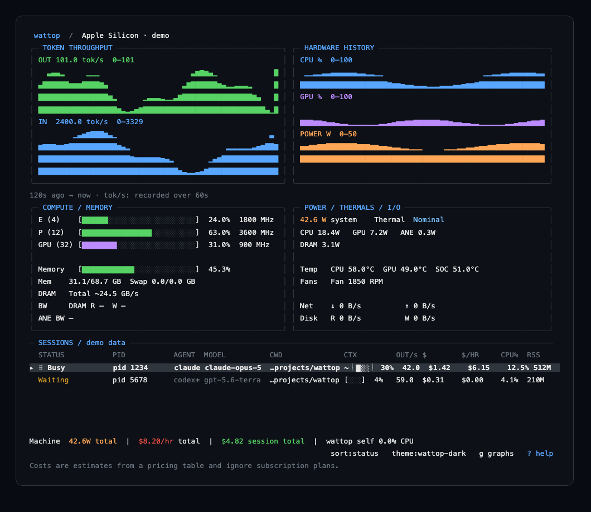

# wattop

[](https://github.com/jasonm4130/wattop/actions/workflows/ci.yml)
[](LICENSE)

**Watch your Mac and your coding agents in one terminal.**

wattop puts Apple Silicon power, CPU, GPU, and thermals beside your Claude Code
and Codex sessions. Two-minute graphs show token activity and hardware load;
session rows show output tokens/s, estimated cost, and process resources.
Four themes, keyboard navigation, and JSON output make it useful at a glance
or as part of your own tooling.

This is an early-stage project. Token rates are 60-second transcript averages,
and dollar figures are estimates—not subscription balances.



*Synthetic demonstration data; rates and costs are illustrative.*

## Scope

macOS, Apple Silicon (arm64) only. Built with CGO against IOReport and SMC,
so it links `-lIOReport`, a private Apple framework — it is **not
cross-compilable** and there is no Linux or Intel build. No external
runtime: no Node, no Python, no subprocess, no Homebrew dependency at
runtime — macOS system frameworks only, one static-enough binary.

## Install from source

Requires **Apple Silicon, macOS, Go 1.27, and Xcode command line tools**.

```sh
git clone https://github.com/jasonm4130/wattop.git
cd wattop
make build
./bin/wattop
```

The build enables CGO for IOReport and SMC. Run `./bin/wattop doctor` to inspect
hardware support on your Mac. The examples below assume `bin/wattop` is on your
`PATH`; otherwise use `./bin/wattop`.

Tagged releases are built by GitHub Actions. See [release maintenance](docs/releasing.md)
for packaging and verification; Homebrew distribution is not configured yet.

## Usage

```
wattop                    # interactive TUI
wattop --theme nord       # or WATTOP_THEME=nord
wattop --interval 2s      # SoC sample interval, 500ms-5s
wattop --json             # one Snapshot per interval as NDJSON, no alt screen
wattop --json --once      # exactly one Snapshot, then exit
wattop --no-color         # or NO_COLOR=1: no ANSI styling, gauges as blocks
wattop doctor             # what actually resolved on this chip
wattop doctor --ioreport-groups  # + every IOReport group and its channel count
```

The default view pairs two-minute input/output token graphs with CPU, GPU,
and power history. `OUT/s` in each session row is output tokens recorded over
the last 60 seconds, divided by 60, including idle time. Input throughput
includes cache reads and writes; output includes reported reasoning tokens.
These are transcript activity rates, not instantaneous model generation speed.
Rates work for Claude, its subagents, and Codex without telemetry setup. Unknown
usage is `—`; observed inactivity is `0.0`. Press `g` for the full hardware
meters and `enter` for cumulative token counts and the selected session's rates.

**Terminal width: the dashboard fits at 80 columns and above; the detail view needs
103 columns.** The table narrows — columns shrink, the context gauge
collapses to `~ 55%`, output rates use compact figures, surplus
rows become a `▼ N more` marker, and `$`, `$/HR`, `CPU%` and `RSS` survive
at these widths. Measured at 80x24 on live sessions it renders exactly 80
cells with nothing past the terminal edge. The **detail view** (`enter`)
has not been narrowed and still reserves 103 cells, so it is cut off below
that; see [`docs/limitations.md`](docs/limitations.md).

`wattop doctor` is the first thing to run on a new machine or after a
macOS upgrade: it prints which SoC channels resolved, how many processes
the scanner enumerated and got a CPU baseline for, how many Claude/Codex
sessions were discovered and pid-bound, and the pricing table's age and
status — all without ever entering the TUI.

### Keybindings

| Key | Action |
|---|---|
| `↑`/`k`, `↓`/`j` | Move selection |
| `enter` | Toggle the session detail view |
| `t` / `T` | Cycle theme forward / back |
| `s` | Cycle sort (status → cost → burn → cpu) |
| `f` | Toggle subagent rows |
| `a` | Show dormant sessions — stale rows bound to no live process are hidden by default, and the footer says how many |
| `p` | Pause the display (collection keeps running) |
| `g` | Toggle history graphs / full hardware meters |
| `?` | Toggle the help overlay |
| `q` / `ctrl+c` | Quit |

### Themes

Four named themes, selected by `--theme`/`WATTOP_THEME` or cycled in-app
with `t`/`T`: `wattop-dark` (default), `wattop-light`, `nord`,
`catppuccin-mocha`. Every widget reads a semantic role (`idle`/`busy`/
`waiting`/`warn`/`hot`/…), never a raw palette color, so a theme swap
re-colours the whole dashboard consistently. `--theme <hex>` (e.g.
`--theme 58a6ff`) layers a bare accent color onto `wattop-dark` instead of
naming a file.

### Config file

`$XDG_CONFIG_HOME/wattop/config.toml` (or `~/.config/wattop/config.toml`)
sets defaults that flags and environment variables override: `theme`,
`interval_ms`, `burn_hot_usd_per_hr`, `codex_stale_minutes`, and
`context_window_overrides` (a Claude session id or cwd to a token count,
overriding the context-fill estimate for that session). A missing file is
not an error — every field just keeps its default.

## Pricing table

Costs are computed from an embedded, filtered snapshot of LiteLLM's pricing
table (`internal/pricing/table.json.gz`), refreshed in the background at
startup and cached, so pricing works instantly and offline on first run.
Run `make pricing` to pull the latest upstream table and regenerate
`docs/pricing-update.md` with the commit and checksum that produced it —
see that file for how to verify the checksum and add a model upstream
hasn't published yet.

## Honest labelling

- Claude context-fill is an estimate (dashed bar edge); Codex's is exact
  from `rate_limits` (solid edge).
- Costs are estimates from the pricing table above and **ignore
  subscription plans** (Claude Pro/Max, ChatGPT/Codex) entirely.
- An unpriced model renders `$—`, never `$0.00` — those mean different
  things.
- Per-session GPU is measured as ms/sec; the derived percent is a rescale
  and never the default sort key.
- Bandwidth renders `—` only where no source exists; a channel that
  resolves and reads zero renders `0.0`. On this chip no DRAM byte
  counter resolves at all, so DRAM shows one power-derived total, marked
  as an estimate (`Total ~14.3 GB/s`) with no read/write split.
- The temperature row shows the three semantic sensors (`CPU`, `GPU`,
  `SOC`) and omits any that did not resolve, rather than every raw SMC key
  the chip exposes.
- `$/hr` counts only spend wattop watched happen. Cost already on disk when
  it starts is baselined, so a fresh launch reads `$0.00/hr` rather than
  extrapolating hours of history into a rate.

See [`docs/limitations.md`](docs/limitations.md) for the full list with
evidence, and [`docs/manual-qa.md`](docs/manual-qa.md) for the checklist
this release was verified against.

## Self-CPU overhead

Measured over a 60-second `--json` run on the M5 Max this was built on:
`Snapshot.self_cpu_pct` settles to **4.2%-7.0% (mean 5.35%)** in steady
state, corroborated independently by `ps -o %cpu` on the running process
(5.4%). The first ~5 samples after startup show a transient over-read of
190-300% before settling — not a sustained cost, but also not yet fully
explained; see [`docs/limitations.md`](docs/limitations.md) and
[`docs/manual-qa.md`](docs/manual-qa.md) item 11 for the raw sample
sequence. A monitor that distorts what it measures must be accountable for
its own overhead; this is that accounting.

## Attribution

wattop vendors and depends on the following MIT-licensed projects — details in [`NOTICE`](NOTICE) and the vendored
[mactop license](internal/soc/mactop/LICENSE):

- **[mactop](https://github.com/metaspartan/mactop)** — Copyright ©
  2024-2026 Carsen Klock. `internal/soc/mactop` is a vendored copy of its
  IOReport/SMC collector layer, pinned to a specific upstream commit (see
  `internal/soc/VENDOR.md`), because that code lives under mactop's own
  `internal/app` and cannot be imported.
- **[ntcharts](https://github.com/NimbleMarkets/ntcharts)** — Copyright ©
  2024-2026 Neomantra Corp. Used as an ordinary dependency for the braille
  sparkline helper.

Also depends on the Charm libraries (Bubble Tea, Lip Gloss, Bubbles),
`BurntSushi/toml`, and `golang.org/x/term`.

## Contributing

Start with [CONTRIBUTING.md](CONTRIBUTING.md) for builds, tests, and pull requests.
[Report a bug](https://github.com/jasonm4130/wattop/issues/new/choose),
[report a vulnerability privately](SECURITY.md), or read the
[code of conduct](CODE_OF_CONDUCT.md).

## License

MIT — see [`LICENSE`](LICENSE).
