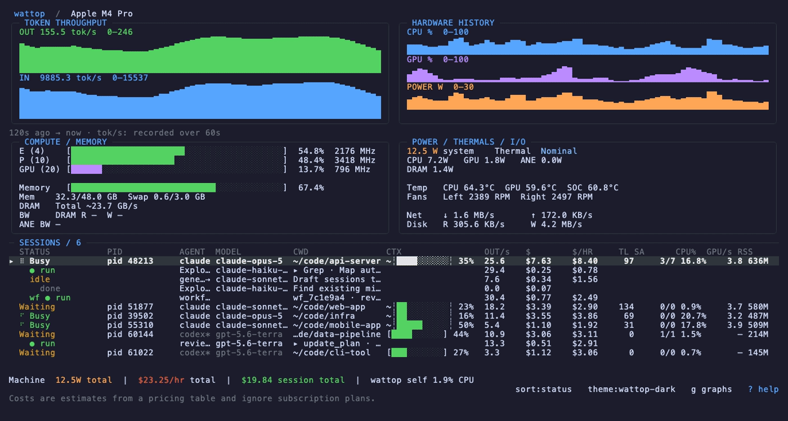

# wattop

[](https://github.com/jasonm4130/wattop/actions/workflows/ci.yml)
[](https://github.com/jasonm4130/wattop/releases/latest)
[](LICENSE)

**A terminal monitor for Apple Silicon Macs that watches your coding agents and your hardware in one pane.**



*Synthetic demonstration data from `wattop --demo` (re-record with `make demo`);
rates and costs are illustrative. [Still image](docs/assets/wattop.png).*

```sh
brew install --cask jasonm4130/wattop/wattop
wattop
```

- **Claude Code and Codex, live.** Every running session with its status, output tokens/s, context fill, estimated cost and `$/hr`, bound to its process's CPU, GPU and memory.
- **Subagents and workflows as a tree.** Claude `Agent` spawns (nested and background), workflow runs with phase and progress, and Codex child threads, each with its own rate and cost.
- **Apple Silicon hardware beside it.** CPU/GPU/ANE/DRAM power, E- and P-cluster load, GPU, temperatures, fans, thermal pressure, memory and swap, network and disk, with two-minute history graphs.
- **No sudo, no runtime dependencies.** Reads IOReport and SMC directly instead of wrapping `powermetrics` (which needs root); one binary, macOS system frameworks only.
- **Scriptable.** `--json` streams one snapshot per interval as NDJSON; `--once` prints one and exits.

## How it compares

| | Hardware power & sensors | Claude Code / Codex sessions | Subagent tree | Live TUI | Needs sudo |
|---|:-:|:-:|:-:|:-:|:-:|
| **wattop** | yes | both, live | yes | yes | no |
| [mactop](https://github.com/metaspartan/mactop) | yes | no | no | yes | no |
| [asitop](https://github.com/tlkh/asitop) | yes | no | no | yes | yes |
| [ccusage](https://github.com/ryoppippi/ccusage) | no | both, plus others (reports) | no | no | no |
| [Claude Code Usage Monitor](https://github.com/Maciek-roboblog/Claude-Code-Usage-Monitor) | no | Claude, live | no | yes | no |

wattop vendors mactop's IOReport/SMC collector (see [Attribution](#attribution)).
Comparison checked against each project's README in September 2026. If you
only want hardware, mactop is excellent; if you want historical usage reports
across many agents, ccusage is. wattop is for watching live agents and the
machine running them at once.

## Privacy

wattop runs entirely on your Mac. It reads Claude Code and Codex transcripts
under `~/.claude` and `~/.codex` read-only and never writes to them. There is
no telemetry and no account. The only network request is a pricing-table
refresh: at most one `GET` per 24 hours to
[LiteLLM's public price list](https://raw.githubusercontent.com/BerriAI/litellm/main/model_prices_and_context_window.json)
on raw.githubusercontent.com, cached in `$XDG_CACHE_HOME/wattop/pricing.json` (default `~/.cache`). If it
fails, the table embedded in the binary is used. `--json` output includes
session working directories, process command lines and subagent
descriptions; treat it like your shell history before sharing it.

## Requirements

Apple Silicon (arm64) with macOS 14 or newer. wattop links Apple's private
IOReport framework through CGO, so there is no Linux or Intel build. Hardware
support varies by chip and macOS version; run `wattop doctor` to see what
resolved on yours, and see [limitations](docs/limitations.md).

This is an early-stage project. Token rates are 60-second transcript averages,
and dollar figures are API-price estimates, not subscription balances.

## Install

```sh
brew install --cask jasonm4130/wattop/wattop
```

Update with `brew update && brew upgrade --cask wattop`.
The [official tap](https://github.com/jasonm4130/homebrew-wattop) tracks stable
releases. You can also download the arm64 archive from
[GitHub Releases](https://github.com/jasonm4130/wattop/releases/latest).
Release archives include checksums and GitHub build provenance; they are not
Apple-notarized. The cask removes quarantine from its installed `wattop` binary
to allow it to launch. See [verification instructions](docs/releasing.md#verify-a-download).

With Go 1.27 and the Xcode command line tools:

```sh
go install github.com/jasonm4130/wattop/cmd/wattop@latest
```

### Build from source

```sh
git clone https://github.com/jasonm4130/wattop.git
cd wattop
make build
./bin/wattop
```

The build enables CGO for IOReport and SMC. The examples below assume `wattop`
is on your `PATH`; otherwise use `./bin/wattop`. Tagged releases are built by
GitHub Actions with a macOS 14 deployment target.

## Usage

```
wattop                    # interactive TUI
wattop --theme nord       # or WATTOP_THEME=nord
wattop --interval 2s      # SoC sample interval, 500ms-5s
wattop --json             # one Snapshot per interval as NDJSON, no alt screen
wattop --json --once      # exactly one Snapshot, then exit
wattop --no-color         # or NO_COLOR=1: no ANSI styling, gauges as blocks
wattop --demo             # synthetic machine and sessions for screenshots; reads no local data
wattop doctor             # what actually resolved on this chip
wattop doctor --ioreport-groups  # + every IOReport group and its channel count
```

The default view pairs two-minute input/output token graphs with CPU, GPU,
and power history. `OUT/s` in each session row is output tokens recorded over
the last 60 seconds, divided by 60, including idle time. Input throughput
includes cache reads and writes; output includes reported reasoning tokens.
These are transcript activity rates, not instantaneous model generation speed.
Rates work for Claude, its subagents, and Codex without telemetry setup. Unknown
usage is `—`; observed inactivity is `0.0`. Press `g` for the full hardware
meters and `enter` for cumulative token counts and the selected session's rates.

Subagents are tracked as a tree under their session: Claude `Agent` spawns
(including nested and background ones), Claude workflow runs, and Codex spawned
and guardian threads. Each child shows its status (`● run`, `idle`, `done`,
`fail`), the tool it is waiting on, output rate, cost and its own `$/hr`. A
workflow collapses to one row with its phase and running/done counts; `enter`
opens the full tree, and the `SA` column reads running/total. A `~` before a
cost means it leaves out usage, the session's own or a child's, on a model
the pricing table does not know.

**Terminal width: the dashboard fits at 80 columns and above; the detail view needs
103 columns.** The table narrows — columns shrink, the context gauge
collapses to `~ 55%`, output rates use compact figures, surplus
rows become a `▼ N more` marker, and `$`, `$/HR`, `CPU%` and `RSS` survive
at these widths. Measured at 80x24 on live sessions it renders exactly 80
cells with nothing past the terminal edge. The **detail view** (`enter`)
has not been narrowed and still reserves 103 cells, so it is cut off below
that; see [`docs/limitations.md`](docs/limitations.md).

`wattop doctor` is the first thing to run on a new machine or after a
macOS upgrade: it prints which SoC channels resolved, how many processes
the scanner enumerated and got a CPU baseline for, how many Claude/Codex
sessions were discovered and pid-bound, and the pricing table's age and
status — all without ever entering the TUI.

### Keybindings

| Key | Action |
|---|---|
| `↑`/`k`, `↓`/`j` | Move selection |
| `enter` | Toggle the session detail view |
| `t` / `T` | Cycle theme forward / back |
| `s` | Cycle sort (status → cost → burn → cpu) |
| `f` | Toggle subagent rows |
| `a` | Show dormant sessions — stale rows bound to no live process are hidden by default, and the footer says how many |
| `p` | Pause the display (collection keeps running) |
| `g` | Toggle history graphs / full hardware meters |
| `?` | Toggle the help overlay |
| `q` / `ctrl+c` | Quit |

### Themes

Four named themes, selected by `--theme`/`WATTOP_THEME` or cycled in-app
with `t`/`T`: `wattop-dark` (default), `wattop-light`, `nord`,
`catppuccin-mocha`. Every widget reads a semantic role (`idle`/`busy`/
`waiting`/`warn`/`hot`/…), never a raw palette color, so a theme swap
re-colours the whole dashboard consistently. `--theme <hex>` (e.g.
`--theme 58a6ff`) layers a bare accent color onto `wattop-dark` instead of
naming a file.

### Config file

`$XDG_CONFIG_HOME/wattop/config.toml` (or `~/.config/wattop/config.toml`)
sets defaults that flags and environment variables override: `theme`,
`interval_ms`, `burn_hot_usd_per_hr`, `codex_stale_minutes`, and
`context_window_overrides` (a Claude session id or cwd to a token count,
overriding the context-fill estimate for that session). A missing file is
not an error — every field just keeps its default.

## Pricing table

Costs are computed from an embedded, filtered snapshot of LiteLLM's pricing
table (`internal/pricing/table.json.gz`), refreshed in the background at
startup and cached, so pricing works instantly and offline on first run.
Each request is priced at its own model and its own long-context tier, so a
`/model` switch or one very long prompt never reprices the rest of a
session. Run `make pricing` to pull the latest upstream table and regenerate
`docs/pricing-update.md` with the commit and checksum that produced it —
see that file for how to verify the checksum and add a model upstream
hasn't published yet.

## Honest labelling

- Claude context-fill is an estimate (dashed bar edge); Codex's is exact
  from `rate_limits` (solid edge).
- Costs are estimates from the pricing table above and **ignore
  subscription plans** (Claude Pro/Max, ChatGPT/Codex) entirely.
- An unpriced model renders `$—`, never `$0.00` — those mean different
  things.
- Per-session GPU is measured as ms/sec; the derived percent is a rescale
  and never the default sort key.
- Bandwidth renders `—` only where no source exists; a channel that
  resolves and reads zero renders `0.0`. On this chip no DRAM byte
  counter resolves at all, so DRAM shows one power-derived total, marked
  as an estimate (`Total ~14.3 GB/s`) with no read/write split.
- The temperature row shows the three semantic sensors (`CPU`, `GPU`,
  `SOC`) and omits any that did not resolve, rather than every raw SMC key
  the chip exposes.
- `$/hr` counts only spend wattop watched happen. Cost already on disk when
  it starts is baselined, so a fresh launch reads `$0.00/hr` rather than
  extrapolating hours of history into a rate.

See [`docs/limitations.md`](docs/limitations.md) for the full list with
evidence, and [`docs/manual-qa.md`](docs/manual-qa.md) for the checklist
this release was verified against.

## Self-CPU overhead

Measured over a 75-second `--json` run on an M5 Max watching 12 Claude/Codex
sessions with 1,293 subagents: `Snapshot.self_cpu_pct` settles to **mean
5.19% (max 6.94%)** in steady state. The first ~5 samples after startup read
95-304% while wattop catches up on existing transcripts (and, on M5-class
chips, calibrates DRAM bandwidth); see [`docs/limitations.md`](docs/limitations.md) and
[`docs/manual-qa.md`](docs/manual-qa.md) item 11. A monitor that distorts what
it measures must be accountable for its own overhead; this is that accounting.

## Attribution

wattop vendors and depends on the following MIT-licensed projects — details in [`NOTICE`](NOTICE) and the vendored
[mactop license](internal/soc/mactop/LICENSE):

- **[mactop](https://github.com/metaspartan/mactop)** — Copyright ©
  2024-2026 Carsen Klock. `internal/soc/mactop` is a vendored copy of its
  IOReport/SMC collector layer, pinned to a specific upstream commit (see
  `internal/soc/VENDOR.md`), because that code lives under mactop's own
  `internal/app` and cannot be imported.
- **[ntcharts](https://github.com/NimbleMarkets/ntcharts)** — Copyright ©
  2024-2026 Neomantra Corp. Used as an ordinary dependency for the braille
  sparkline helper.

Also depends on the Charm libraries (Bubble Tea, Lip Gloss, Bubbles),
`BurntSushi/toml`, and `golang.org/x/term`.

## Contributing

Start with [CONTRIBUTING.md](CONTRIBUTING.md) for builds, tests, and pull requests.
[Report a bug](https://github.com/jasonm4130/wattop/issues/new/choose),
[report a vulnerability privately](SECURITY.md), or read the
[code of conduct](CODE_OF_CONDUCT.md).

## License

MIT — see [`LICENSE`](LICENSE).
